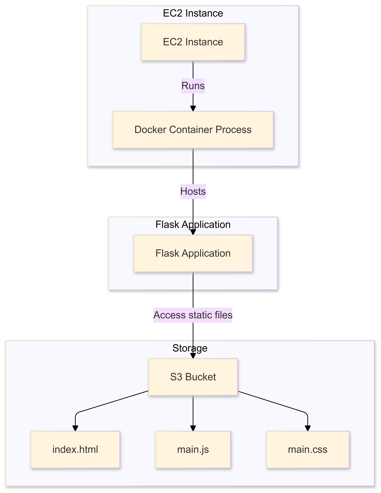

# Overview

# AWS Chatroom with EC2, Docker, Flask, and S3
A chat application hosted on AWS utilizing EC2 instances with Docker containers to serve a Flask web application and static content from S3.

## Project Structure

## Setup Instructions

### How To Run on AWS

#### Clone Repo
