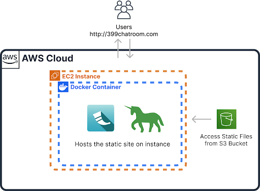
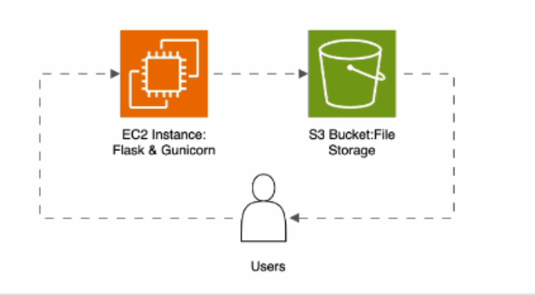

# AWS Chatroom with EC2, Docker, Flask, and S3

A chat application hosted on AWS utilizing EC2 instances with Docker containers to serve a Flask web application and static content from S3.

# Architecture Diagram


# Architecture Flowchart


## Launch on EC2 (Console Deployment)

The steps to deploy on an EC2 instance are contained in [`userdata.sh`](userdata.sh).  Study this file, and be sure you understand each line.

* Create an EC2 instance
  * Name: `chatroom_ec2_flask_docker_s3`
  * Key Pair: `vockey`
  * Network Settings: Allow HTTP traffic from the internet
  * Advance Details / User Data - paste in [`userdata.sh`](userdata.sh)
* Connect to the instance

  ```
  ssh -i ~/.ssh/labsuser.pem ec2-user@<instance IP>
  ```

* Open `http://<EC2 IP>` in a web browser

